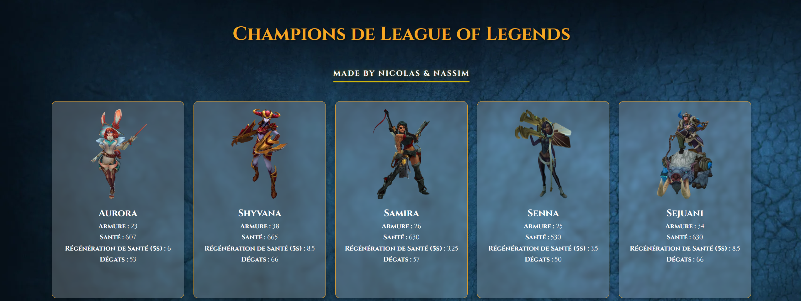

# Projet de récupération des champions League of Legends

## Équipe
- **Nassim Y**
- **Nicolas D**

## Justification du choix de Scrapy
Scrapy est un framework Python spécialement conçu pour le web scraping. Il offre une structure de projet claire, une gestion asynchrone des requêtes et une communauté active. Cela le rend particulièrement efficace pour extraire des listes structurées (comme celles des champions) à partir de pages web.

## Étapes pour lancer le projet

1. **Lancer la commande Scrapy pour générer le Json** :  
   ```
   scrapy crawl championspider


## Preview
